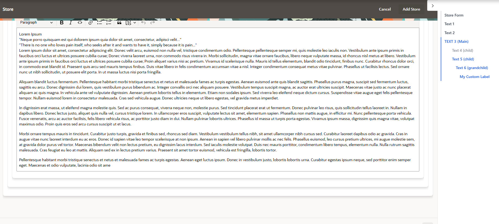
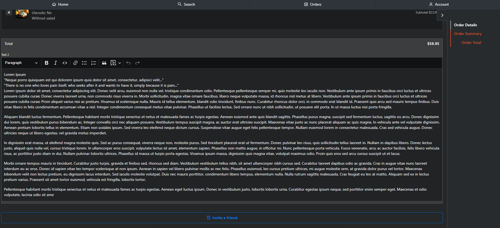

# APEX Page Anchor Navigator (PAN)

A **Template Component Plug-in** for Oracle APEX that renders a sticky sidebar table of contents with scroll-tracking and active section highlighting — similar to documentation sites like MDN, Ant Design, or React docs.


## Features

- 🔗 **Automatic PAN generation** from page regions using CSS classes
- 📍 **Scroll-aware highlighting** — active section updates as you scroll
- 🎨 **Configurable colors** — indicator and track colors via plugin attributes
- 🔒 **XSS-safe** — DOM-based rendering with input sanitization (no `innerHTML`)
- 📐 **Nested levels** — unlimited depth via `.js-pan-N` classes
- 🏷️ **Custom labels** — override region titles with `data-js-pan-label`
- ⚡ **Smooth scrolling** — click any PAN item to scroll to the section
- 🧩 **Declarative attributes** — configure via Page Designer, no code needed

## Preview

| Light Theme | Dark Theme |
|---|---|
|  |  |
|  |  |

## Requirements

- Oracle APEX **21.2** or higher (Template Component Plug-in support)
- For APEX 19.2–21.1, see the [Region Plug-in version](#legacy-version-apex-192)

## Installation

1. Download the latest release `.sql` file from [Releases](../../releases)
2. In your APEX application, go to **Shared Components → Plug-ins**
3. Click **Import**
4. Select the downloaded `.sql` file
5. Follow the wizard to complete the import

## Quick Start

### 1. Add the PAN Region

1. Open your page in **Page Designer**
2. Create a new region in the **Right Side Column** (or any sidebar position)
3. Set **Type** to **Page Anchor Navigator**

### 2. Tag Your Regions

Add a CSS class to any region you want in the PAN:

| CSS Class | Level | Description |
|---|---|---|
| `js-pan` | 0 | Top-level section |
| `js-pan-1` | 1 | Child / sub-section |
| `js-pan-2` | 2 | Grandchild |
| `js-pan-N` | N | Any depth level |

In Page Designer:
- Select the region
- Go to **Appearance → CSS Classes**
- Add the appropriate class (e.g., `js-pan` or `js-pan-1`)

> **Important:** Each tagged region must have a **Static ID** set (under Advanced).

### 3. Optional: Custom Labels

By default, the PAN uses the **Region Title**. To override it, add a custom attribute to the region:

```
data-js-pan-label="My Custom Label"
```

In Page Designer: Region → **Advanced → Custom Attributes**

## Plugin Attributes

Configure these in Page Designer when you select the PAN region:

| Attribute | Type | Default | Description |
|---|---|---|---|
| **Scroll Offset (px)** | Integer | `100` | Distance from viewport top to trigger active state |
| **Animation Speed (ms)** | Integer | `200` | Speed of the indicator animation |
| **Show Parent Highlight** | Yes/No | `Yes` | Highlight parent items when a child is active |
| **Indicator Color** | Color | `#2563eb` | Color of the active indicator on the track |
| **Track Color** | Color | `#d1d5db` | Color of the vertical track line |

## Example Page Structure

```
Page
├── Content Body
│   ├── Region: "Overview"        → CSS Classes: js-pan, Static ID: overview
│   ├── Region: "Installation"    → CSS Classes: js-pan, Static ID: installation
│   │   ├── Region: "Step 1"      → CSS Classes: js-pan-1, Static ID: step1
│   │   └── Region: "Step 2"      → CSS Classes: js-pan-1, Static ID: step2
│   ├── Region: "API Reference"   → CSS Classes: js-pan, Static ID: api
│   └── Region: "FAQ"             → CSS Classes: js-pan, Static ID: faq
│
└── Right Side Column
    └── Region: "Page Anchor Navigator" (Plugin)
```

## Customization

### Override Styles

The plugin uses CSS custom properties. Override them in your page or theme CSS:

```css
#page-pan {
    --pan-indicator-color: #e11d48;  /* Rose */
    --pan-track-color: #e5e7eb;
    --pan-animation-speed: 300ms;
}
```

### Dark Theme

```css
#pan-list a {
    color: #9ca3af;
}

#pan-list a:hover {
    color: #f3f4f6;
}

#pan-list a.is-current {
    color: #60a5fa;
}

.pan-track {
    background: #374151;
}
```

## Security

This plugin follows security best practices:

- **No `innerHTML`** — all DOM elements created via `document.createElement()` + `textContent`
- **Input sanitization** — labels are whitelist-filtered (alphanumeric, common punctuation, accented characters)
- **ID validation** — only valid HTML IDs accepted (`[a-zA-Z][\w-]*`)
- **Color validation** — only hex, rgb/rgba/hsl/hsla, or named CSS colors
- **`CSS.escape()`** — prevents selector injection attacks
- **Max label length** — capped at 100 characters


## Browser Support

| Browser | Supported |
|---|---|
| Chrome 60+ | ✅ |
| Firefox 55+ | ✅ |
| Safari 12+ | ✅ |
| Edge 79+ | ✅ |
| IE 11 | ❌ |

## Contributing

Contributions are welcome! Please:

1. Fork the repository
2. Create a feature branch (`git checkout -b feature/my-feature`)
3. Commit your changes (`git commit -m 'Add my feature'`)
4. Push to the branch (`git push origin feature/my-feature`)
5. Open a Pull Request

## License

This project is licensed under the MIT License — see the [LICENSE](LICENSE) file for details.

## Author

**Bruno Tiago Cardoso**

## Acknowledgments

- Built with [Oracle APEX](https://apex.oracle.com/)
- Inspired by documentation navigation patterns from Ant Design, React, and MDN
